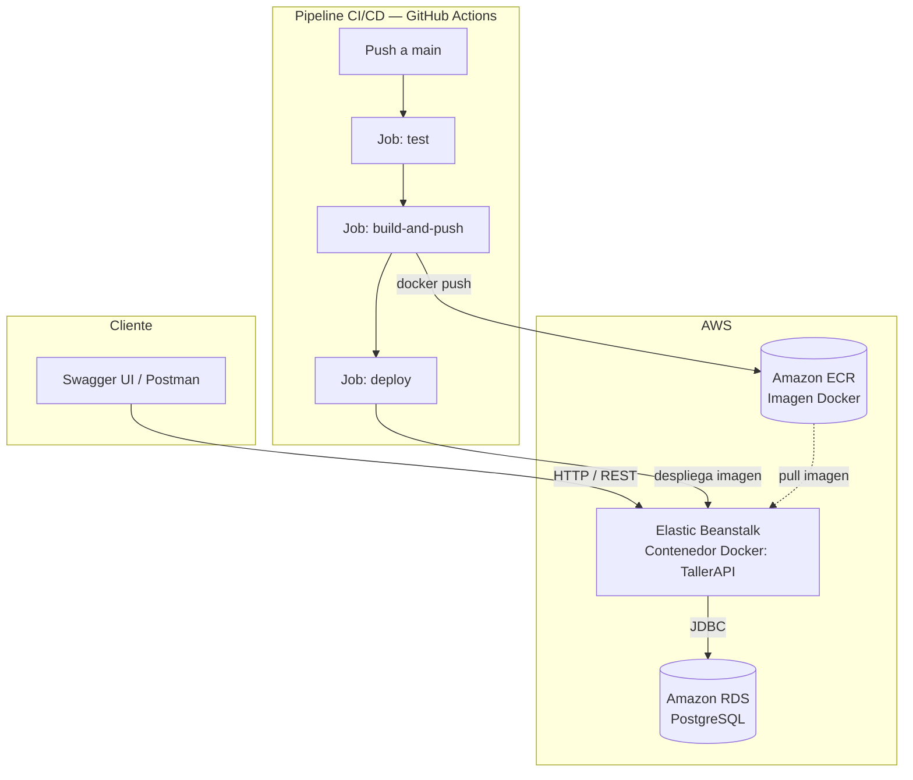

# 🪵 TallerAPI

[](https://github.com/jcarlosx69/tallerapi/actions)

<!-- 👆 Sustituye `NOMBRE_WORKFLOW.yml` por el nombre real de tu archivo en `.github/workflows/` (p. ej. `ci-cd.yml`) antes de publicar -->

**De la madera al código** · Gestión de inventario y proyectos de un taller de carpintería

> Diseño, desarrollo y despliegue en AWS de una API REST con Spring Boot 3 y Java 21 para gestión de inventario y proyectos de un taller de carpintería, con autenticación JWT, suite de 94 tests automatizados (JUnit 5, Mockito, MockMvc) y pipeline CI/CD en GitHub Actions.

---

## Sobre este proyecto

Después de treinta años trabajando la madera, decidí formalizar algo que llevaba tiempo construyendo en paralelo: una segunda carrera como desarrollador. **"De la madera al código"** es el nombre que le di a esa transición, y TallerAPI es su pieza más reciente.

Mi primer proyecto de portfolio, [labjc.es](https://labjc.es), ya demostraba backend con Spring Boot y una capa web con Thymeleaf, autoalojado en mi propio servidor. Pero al revisar ofertas de desarrollador junior/mid, dos palabras se repetían constantemente y no estaban cubiertas: **contenedores** y **cloud**. TallerAPI nace específicamente para cerrar ese hueco, sin tocar ni duplicar lo que labjc.es ya demuestra.

El dominio elegido —inventario y proyectos de un taller de carpintería— no es casual: conecta con mi oficio de origen y, de paso, obliga a implementar lógica de negocio real (validación de stock, máquina de estados, integridad referencial) en lugar de otro CRUD genérico de "lista de tareas".

## Stack tecnológico

| Capa               | Tecnología                                              |
| ------------------ | ------------------------------------------------------- |
| Lenguaje / Runtime | Java 21 (LTS)                                           |
| Framework          | Spring Boot 3.3.4 (Web, Data JPA, Security, Validation) |
| Base de datos      | PostgreSQL (AWS RDS)                                    |
| Migraciones        | Flyway                                                  |
| Seguridad          | Spring Security + JWT (JJWT 0.12.6, HS384)              |
| Testing            | JUnit 5, Mockito, MockMvc                               |
| Documentación API  | springdoc-openapi (Swagger UI)                          |
| Contenedores       | Docker (build multi-stage), docker-compose              |
| CI/CD              | GitHub Actions                                          |
| Cloud              | AWS Elastic Beanstalk (plataforma Docker) + RDS + ECR   |
| Build              | Maven                                                   |

## Arquitectura



> El código fuente de este diagrama está disponible por separado en [`diagrama-arquitectura.mmd`](./diagrama-arquitectura.mmd) para facilitar futuras ediciones.

## Funcionalidades principales

- Autenticación JWT con roles `ADMIN` / `USER`
- CRUD completo de Clientes y Materiales
- Gestión de Proyectos con máquina de estados (`EN_CURSO → TERMINADO → ENTREGADO`)
- Asignación de materiales a proyectos con validación de stock en tiempo real
- Integridad referencial (no se puede eliminar un cliente o material con dependencias activas)
- Paginación y filtros en los listados
- Documentación interactiva vía Swagger / OpenAPI

## Ejecución local con Docker

```bash
git clone https://github.com/jcarlosx69/tallerapi.git
cd tallerapi
cp .env.example .env
# Edita .env con tus valores: credenciales de base de datos, secreto JWT, etc.
docker compose up --build
```

La API queda disponible en `http://localhost:8080` y la documentación interactiva en `http://localhost:8080/swagger-ui.html`.

Revisa `.env.example` para ver el listado completo de variables necesarias (conexión a PostgreSQL, secreto y expiración del JWT, perfil activo de Spring).

## Testing

```bash
mvn test
```

La suite incluye **94 tests automatizados**: 47 unitarios (Mockito, capa de servicio) y 47 de integración (MockMvc, endpoints completos incluyendo casos de error 400/401/403/404/409). Los tests se ejecutan automáticamente en el pipeline de CI antes de cualquier build o despliegue.

## Despliegue

TallerAPI está desplegado en **AWS Elastic Beanstalk** (plataforma Docker), con **RDS PostgreSQL** como base de datos gestionada de forma independiente al ciclo de vida del entorno de Beanstalk. El pipeline de **GitHub Actions** construye la imagen Docker, la publica en **ECR** y despliega automáticamente en cada push a `main`.

> 💰 El entorno de AWS se mantiene apagado fuera de las verificaciones para controlar el consumo de créditos. Si necesitas comprobar el despliegue en vivo, indícalo y se reactiva: `<URL_DE_ELASTIC_BEANSTALK>/swagger-ui.html`

## Decisiones técnicas destacadas

- **Java 21 en lugar de Java 17** — se priorizó la versión LTS más reciente, con mayor adopción en el mercado laboral actual, sobre la propuesta inicial del documento de requisitos.
- **Flyway desde el primer commit** — en lugar de `ddl-auto`, para tener control explícito y versionado del esquema de base de datos desde el principio del proyecto.
- **RDS desacoplado del ciclo de vida de Elastic Beanstalk** — la base de datos se gestiona de forma independiente para evitar pérdida de datos si el entorno de Beanstalk se recrea o se destruye.
- **Imagen Docker multi-stage con usuario no-root** — build con Maven en una etapa, imagen final ligera (`eclipse-temurin:21-jre-alpine`, ~183MB) ejecutada sin privilegios de root.
- **Usuario IAM de mínimo privilegio para CI/CD** — las credenciales usadas por GitHub Actions tienen exclusivamente los permisos necesarios para construir, publicar y desplegar, no acceso administrativo completo.

## Documentación adicional

Para una guía detallada de cada endpoint, ejemplos de peticiones/respuestas y casos de uso, consulta el [Manual de uso de TallerAPI](./manual-uso-tallerapi.md).

## Contacto

**Juan Carlos Gómez López**
Carpintero de oficio, desarrollador Fullstack Java/Angular en transición.

- GitHub: [@jcarlosx69](https://github.com/jcarlosx69)
- Portfolio: [labjc.es](https://labjc.es)
- LinkedIn: www.linkedin.com/in/juan-carlos-gomez-94064012a

---

*Este proyecto forma parte de "De la madera al código": treinta años construyendo en madera, ahora construyendo en código.*
